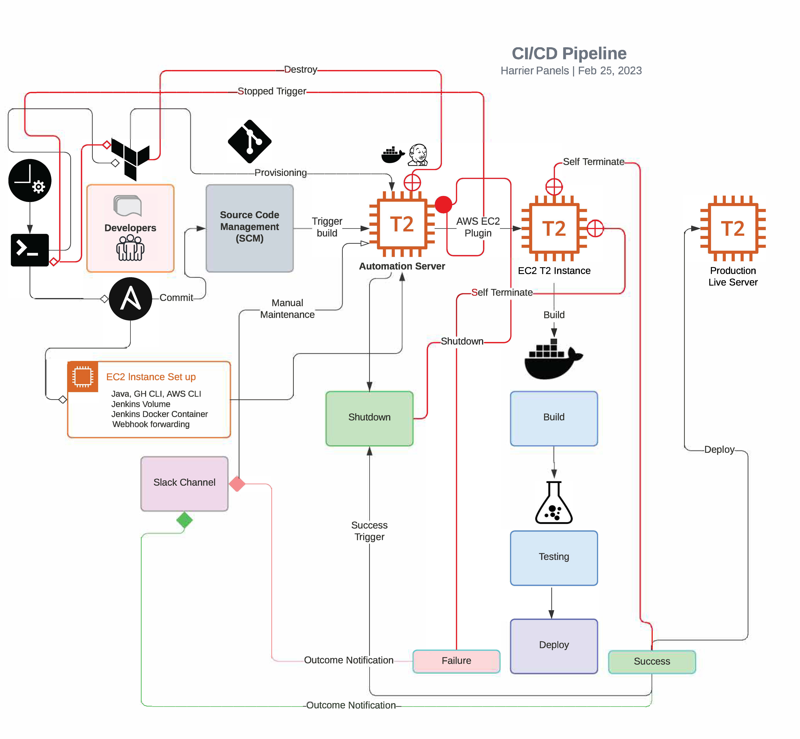

[](./)
[](./)
[](http://hits.dwyl.com/HarrierPanels/sql)
<br>
PHP based CMS: Aviation blog Template CI/CD:

###### Prerequisites
- Content Management Team (to add content)
- Developer Team (to add more features to CMS)
- Design Team (to add more visual effects, etc.)
  - Servers: Local LAMP server, GitHub
 ## 
- DevOps (CI/CD)
  - Ansible / Terraform controller local node
  - Toolchain: AWS CLI, GH CLI, Terraform, Ansible, Docker, Jenkins, Crontab
- Production Team
  - Live LAMP server (AWS EC2)

The process will start as a Crontab job ([see below](#shell)) - a Shell script started on an hourly basis. It could be more or less frequent. The Shell script will also create a temporary folder for Terraform & Ansible. 

The whole process has 4 stages: Pre-Build - the infrastracture for Jenkins is created & configured by Terraform & Ansible. First Terraform will create a subnet as well as security group and then attach them to a newly created EC2 instance. It also creates a security group for the AWS EC2 Plugin:
```
resource "aws_instance" "jenkins_docker" {
  ami                         = data.aws_ami.AL2_latest.id
  instance_type               = "t2.micro"
  associate_public_ip_address = true
  subnet_id                   = aws_subnet.subnet-jenkins_docker.id
  vpc_security_group_ids      = [aws_security_group.sg-jenkins_docker.id]
  key_name                    = "key_name"
  tags = {
    Name = "Jenkins-Docker"
  }
}
data "aws_ami" "AL2_latest" {
  owners = ["137112412989"]
  most_recent = true
  filter {
    name = "name"
    values = ["amzn2-ami-kernel-5.10-hvm-*-x86_64-gp2"]
  }
}
data "aws_availability_zones" "avail" {
  state = "available"
}
data "aws_caller_identity" "current" {}
data "aws_region" "current" {}
data "aws_vpc" "Dev_vpc" {
  tags = {
    Name = "Dev"
  }
}
resource "aws_subnet" "subnet-jenkins_docker" {
  vpc_id = data.aws_vpc.Dev_vpc.id
  availability_zone = data.aws_availability_zones.avail.names[0]
  cidr_block = "172.31.96.0/24"
  tags = {
    Name = "Subnet-in-\${data.aws_availability_zones.avail.names[0]}"
    Account = "Subnet in acc. \${data.aws_caller_identity.current.account_id}"
    Region = data.aws_region.current.description
  }
}
resource "aws_security_group" "sg-jenkins_docker" {
  name        = "sg_jenkins_docker"
  description = "Allow TCP/SSH inbound/outbound traffic"
        dynamic "ingress" {
                for_each = ["80", "8080", "443"]
                        content {
                                from_port = ingress.value
                                to_port = ingress.value
                                protocol = "tcp"
                                cidr_blocks = ["0.0.0.0/0"]
                        }
        }
  ingress {
    description      = "SSH from IP"
    from_port        = 22
    to_port          = 22
    protocol         = "tcp"
    cidr_blocks      = ["178.150.20.173/32"]
  }
  egress {
    from_port        = 0
    to_port          = 0
    protocol         = "-1"
    cidr_blocks      = ["0.0.0.0/0"]
  }
  tags = {
    Name = "allow_tcp_ssh"
  }
}
resource "aws_security_group" "sg-jenkins_docker_ec2_plugin_slave" {
  name        = "sg_jenkins_docker_ec2_plugin_slave"
  description = "Allow TCP/SSH inbound/outbound traffic"
        dynamic "ingress" {
                for_each = ["80", "8080", "443"]
                        content {
                                from_port = ingress.value
                                to_port = ingress.value
                                protocol = "tcp"
                                cidr_blocks = ["0.0.0.0/0"]
                        }
        }
  ingress {
    description      = "SSH from Jenkins Docker master"
    from_port        = 22
    to_port          = 22
    protocol         = "tcp"
    security_groups  = [aws_security_group.sg-jenkins_docker.id]
  }
  egress {
    from_port        = 0
    to_port          = 0
    protocol         = "-1"
    cidr_blocks      = ["0.0.0.0/0"]
  }
  tags = {
    Name = "allow_tcp_ssh_slave"
  }
}
```
Then Ansible would deploy a Jenkins Docker container with an attached Jenkins volume previously uploaded by the Ansible controller containig the necessary preset of Jenkins plugins, credentials and agents to run a pre-configured pipeline to Build, Test, & Deploy. The pipeline is triggered by GitHub Webhook that is set by Ansible using the GH CLI webhook forwarding feature (Beta):
```
gh webhook forward --events=push --repo=HarrierPanels/sql \ 
                --url="http://localhost:8080/github-webhook/"
```
Then DB & CMS coding backup is carried out locally by the Shell script. The backups are put into a local Github repo folder. When done Ansible will make git commit ([see below](#push)).

Triggered out by GitHub Webhook a declarative pipeline (Jenkinsfile) job (Build, Test, & Deploy) is started by the Jenkins controller using as its agents EC2 instances started and terminated when the job is done by AWS EC2 Plugin. 

1. Pre-Build

a) DB & coding automatic backup by Crontab / Shell script:
 - MySQL no password promt login:
   ~/.my.cnf
 - <a id="shell"></a>Hourly cron job:</a>
    - 0 * * * * $HOME/cmsbkp.sh >>$HOME/sql/mysql/bkp.log 2>>$HOME/sql/mysql/err.log
 - <a id="push"></a>Commit by Ansible & Push to GitHub automatically by hook:
   ~/sql/.git/hooks/post-commit

2. Build

a) Step 1
 - the repo is git cloned

b) Step 2
 - the DB & PHP coding backup files as well as generated files required for testing are placed in the docker folder.

c) Step 3
- a Docker LAMP stack is build and started by docker-compose

3. Testing DB & Code

a) Step 1 'Docker test':
 - Check if the docker build LAMP server is ready for testing

b) Step 2 'DB test':
- DB is tested for accessibility by checking if the user 'test' has access to the CMS control Panel with password '12345'

c) Step 3 'CMS test':
- CMS is test checked if new articles are added to the template blog. The test will fail if the latest article publication date is earlier than that on the Live server.

4. Deployment to Live EC2 Server

a)  Step 1
 - Preparing tested files to deploy

b) Step 2
 - Transfering files using Publish Over SSH Plugin

c) Step 3
 - Deploying DB & Coding part

d) Step 4 
 - Cleaning up transferred files 

If the job fails the EC2 instance with Jenkins will be ready for manual maintenance. Whether successful or failed Jenkins will send a message to a Slack channel using Slack Notifications plugin set up in the post section of the pipeline Jenkinsfile:
```
    post {
       // only triggered when blue or green sign
       success {
           slackSend color: "#439FE0", message:"Build deployed successfully - ${env.JOB_NAME} ${env.BUILD_NUMBER}"
       }
       // triggered when red sign
       failure {
           slackSend color: "#e04351", failOnError:true, message:"Build failed  - ${env.JOB_NAME} ${env.BUILD_NUMBER}"
       }
    }
```
If it is successful the next job would shut down the Jenkins controller EC2 instance and when its state would come stopped the Shell script would trigger Terraform to destroy the created infrastructure. 

This job should be started on a Jenkins local agent with a pre-set IP and SSH key that would be also provisioned by Ansible in the following tasks:
```
      - name: Create authorized_keys if not exists
        ansible.builtin.file:
          path: "{{ auth_key }}"
          state: touch
          owner: ec2-user 
          group: ec2-user
          mode: '0600'
        when: not stat_result.stat.exists

      - name: Add SSH key & IP to loopback
        ansible.builtin.shell: |
          echo 'ssh-rsa XXXXXXXXXXXXXXXXX' >> /home/ec2-user/.ssh/authorized_keys
          ip a a 172.31.80.80 dev lo
          route add -host 172.31.80.80 dev lo
          echo "---------------"
          echo "Public Key & IP added"
        register: ip
        async: 10
        poll: 2
```

